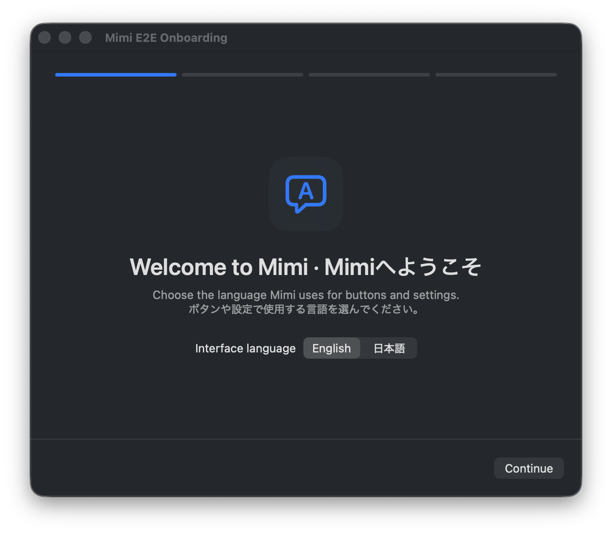
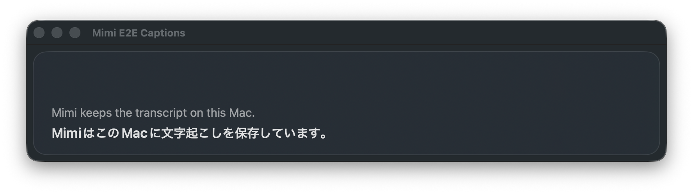
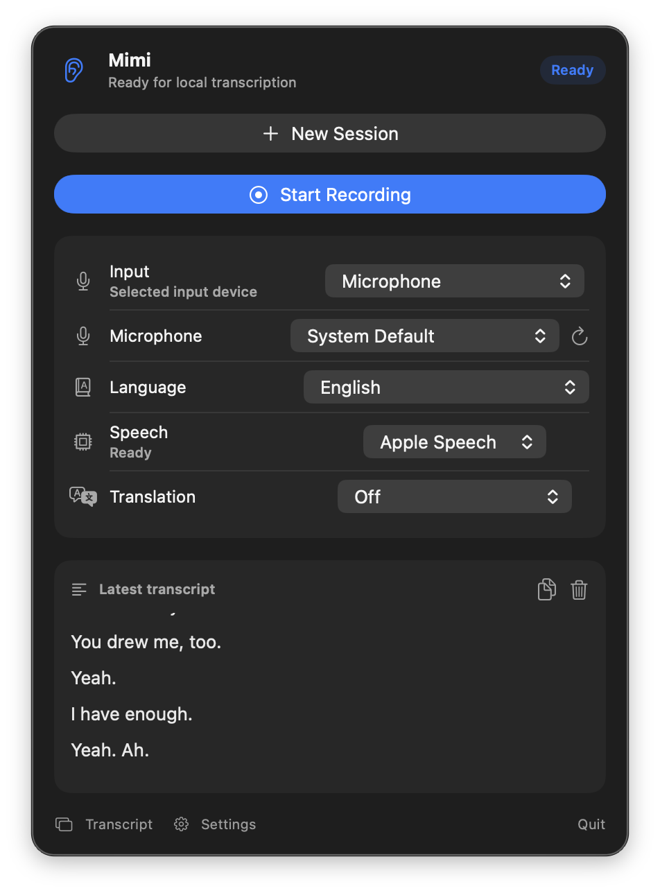
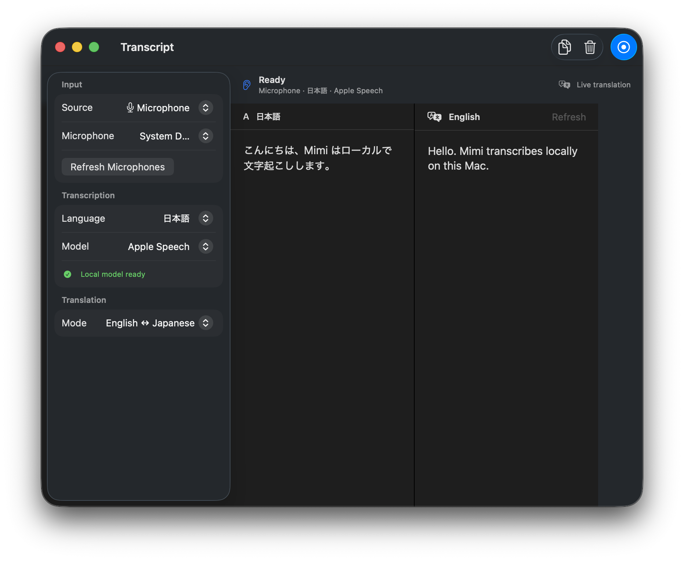

# Mimi

Mimi is a private English and Japanese transcription app for macOS. It lives
in the menu bar, listens only to the source you choose, and keeps transcription
and translation on your Mac.

`Mimi` (耳) means “ear” in Japanese.

## A quick look

| Simple setup | Floating captions |
| --- | --- |
|  |  |

| Menu-bar controls | Transcript history and translation |
| --- | --- |
|  |  |

## What Mimi can do

- Transcribe a microphone, audio output, app, or display.
- Recognize English and Japanese automatically as speech arrives.
- Translate between English and Japanese locally.
- Float original text, translations, or both above other apps.
- Type into the selected field by speaking, with a global shortcut.
- Keep previous sessions so you can return to them later.
- Open automatically when you log in, if you choose.

Mimi uses Apple Speech for live transcription. Automatic language detection
uses a small local helper that is downloaded only when you choose Auto.

## Requirements

- macOS 15 or later.
- macOS 26 or later for Apple’s fastest live transcription.
- Apple Silicon is recommended for automatic language detection.

## Run it locally

```sh
swift build
scripts/build-app.sh debug
open .build/Mimi.app
```

macOS asks for microphone or system-audio access only when the selected source
needs it. Languages are prepared in **Settings → Languages**. To dictate into
another app, enable **Voice Type** during setup or in Settings, place the cursor
in a text field, press the chosen shortcut, speak, and press it again to insert.

## Test it

```sh
scripts/test.sh
```

This covers English and Japanese transcription, model setup, capture cleanup,
and the native interface in light and dark appearances.

For implementation details, benchmarks, and physical-Mac checks, see:

- [Version 1 plan](docs/V1_PLAN.md)
- [Realtime benchmark](docs/REALTIME_BENCHMARK.md)
- [Third-party notices](THIRD_PARTY_NOTICES.md)

## Release status

Mimi is under active development. CI builds a locally testable app, but the
release is not yet Developer ID signed or notarized.
