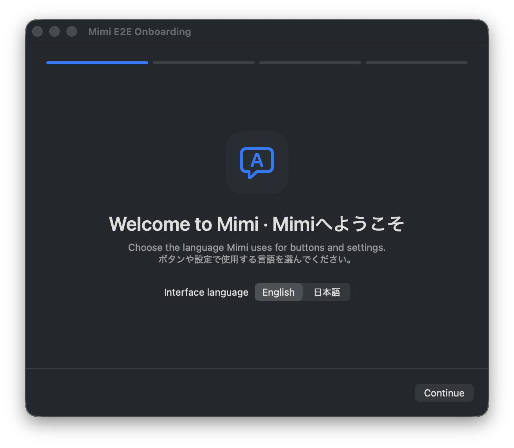
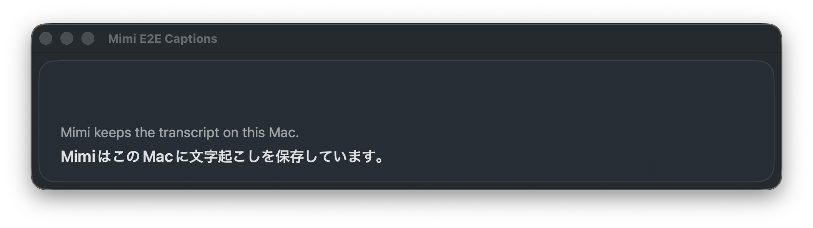
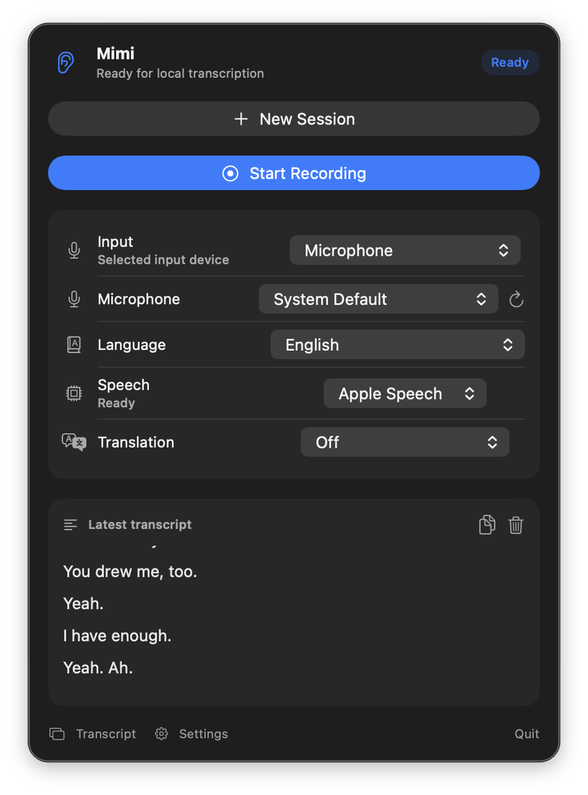
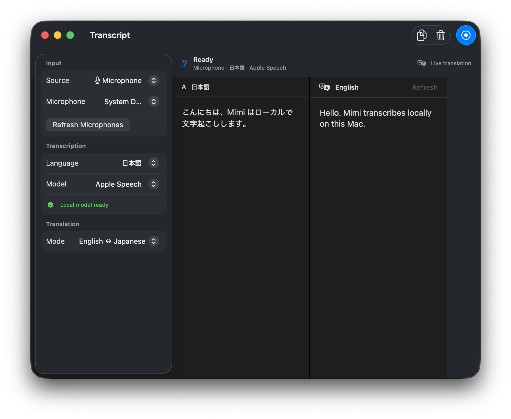
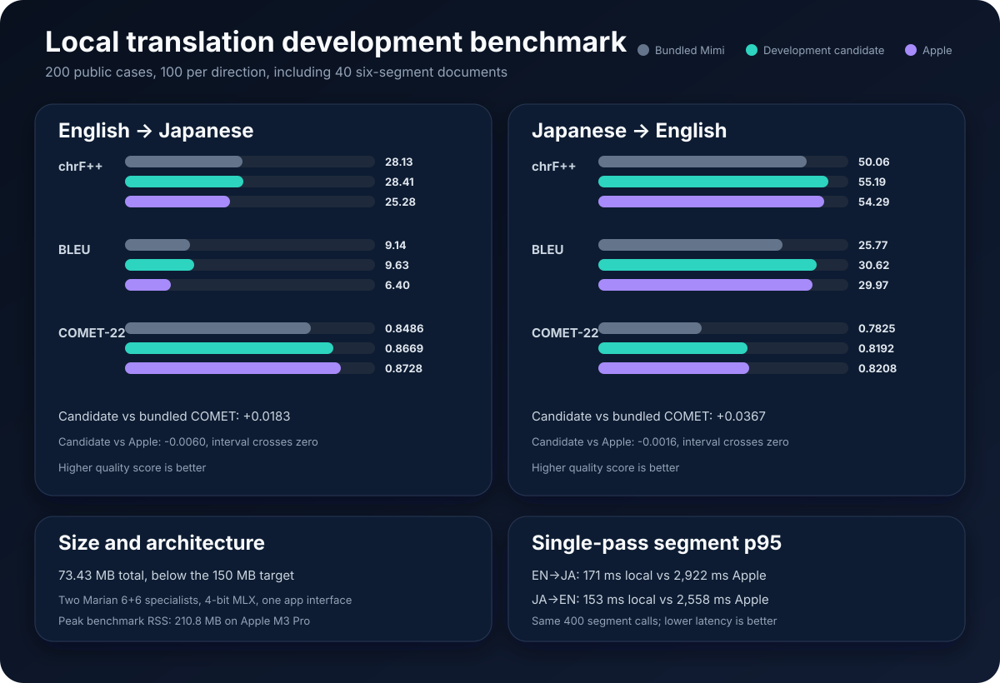

# Mimi

Mimi is a private English and Japanese transcription app for macOS. It lives
in the menu bar, listens only to the source you choose, and keeps transcription
and translation on your Mac.

`Mimi` (耳) means “ear” in Japanese.

## A quick look

| Simple setup | Floating captions |
| --- | --- |
|  |  |

| Menu-bar controls | Transcript history and translation |
| --- | --- |
|  |  |

## What Mimi can do

- Transcribe a microphone, audio output, app, or display.
- Recognize English and Japanese automatically as speech arrives.
- Translate between English and Japanese locally.
- Float original text, translations, or both above other apps.
- Type into the selected field by speaking, with a global shortcut.
- Keep previous sessions so you can return to them later.
- Open automatically when you log in, if you choose.

Mimi uses Apple Speech for live transcription. Automatic language detection
uses a small local helper that is downloaded only when you choose Auto.
English↔Japanese translation uses the bundled 73.4 MB ElanMT Marian model
through MLX; translation text never leaves the Mac and does not use Apple
Translation.

## Local translation



Mimi's development build bundles a 73.4 MB bidirectional translator made from
two small Marian specialists, one for each direction. The exact model and
benchmark are public:

- [Model and weights on Hugging Face](https://huggingface.co/blazeofchi/mimi-en-ja-mlx-development-v1)
- [Benchmark data on Hugging Face](https://huggingface.co/datasets/blazeofchi/mimi-en-ja-development-v1)

The candidate starts from pinned ElanMT checkpoints and is continued on
licensed human translations and Mimi-owned pairs. It was not trained from
scratch and uses no synthetic targets or reasoning traces. The EN→JA model
averages three checkpoints; the JA→EN model uses the strongest legal-specialist
checkpoint. Both are quantized to 4-bit MLX weights.

On the public 200-case benchmark, Mimi scores 28.41 and 55.19 chrF++, 9.63 and
30.62 BLEU, and 0.8669 and 0.8192 COMET-22 for EN→JA and JA→EN. It stays below
155 ms segment p95 on the benchmark Mac. On the same 400 segment calls, Mimi is
33.1× and 16.5× faster at p95 than Apple Translation for EN→JA and JA→EN. The
signed release package keeps the previous stable model because a known long
legal document can trigger repetition and the public suite is not a promotion
test.

## Requirements

- macOS 15 or later.
- macOS 26 or later for Apple’s fastest live transcription.
- Apple Silicon is required for the bundled local translator and recommended
  for automatic language detection.

## Run it locally

```sh
swift build
scripts/build-app.sh debug
open .build/Mimi.app
```

macOS asks for microphone or system-audio access only when the selected source
needs it. Languages are prepared in **Settings → Languages**. To dictate into
another app, enable **Voice Type** during setup or in Settings, place the cursor
in a text field, and press the chosen shortcut. Words appear directly in the
field as you speak; press the shortcut again to stop.

## Test it

```sh
scripts/test.sh
```

This covers English and Japanese transcription, model setup, capture cleanup,
and the native interface in light and dark appearances.

For implementation details, benchmarks, and physical-Mac checks, see:

- [Version 1 plan](docs/V1_PLAN.md)
- [Realtime benchmark](docs/REALTIME_BENCHMARK.md)
- [Translation development report](Research/translation/development-accuracy-v1-report.md)
- [Third-party notices](THIRD_PARTY_NOTICES.md)

## Release status

Mimi is under active development. Official tagged GitHub releases are built by
CI, signed with Developer ID, notarized by Apple, stapled, and verified with
Gatekeeper before the archive is published.
