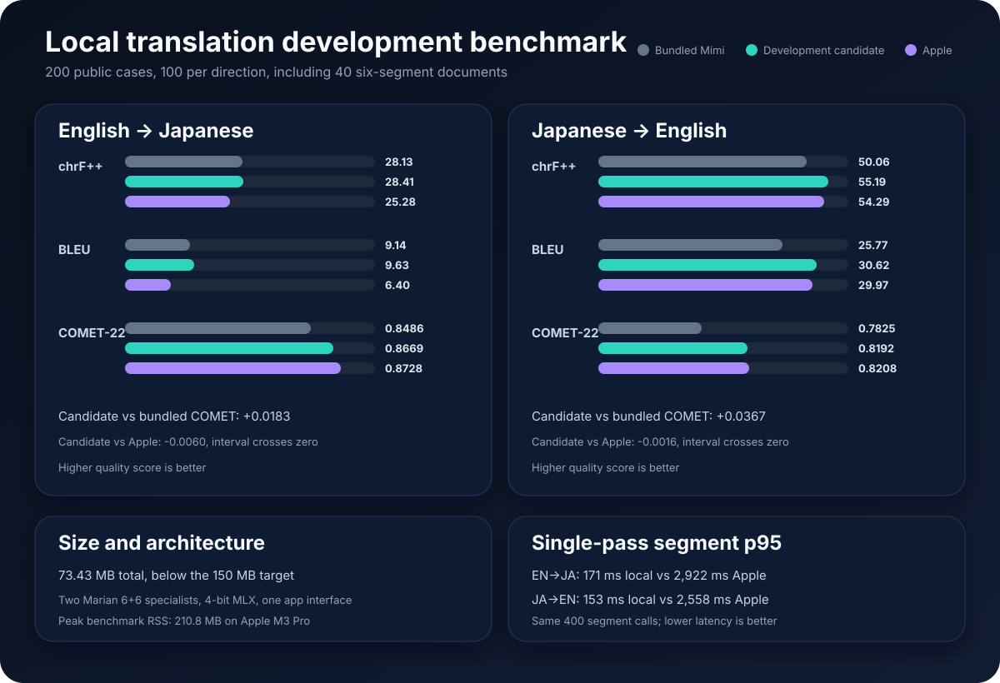

# Mimi

Mimi is a private English and Japanese transcription app for macOS. It lives
in the menu bar, listens only to the source you choose, and keeps transcription
and translation on your Mac.

`Mimi` (耳) means “ear” in Japanese.

## A quick look

| Sessions and recording | Spoken language |
| --- | --- |
|  |  |

Record continues the open session. Use **+** beside Sessions to start a new one.
With no sessions, Record creates the first session automatically.

## What Mimi can do

- Transcribe a microphone, audio output, app, or display.
- Recognize English and Japanese automatically as speech arrives.
- Translate between English and Japanese locally.
- Float original text, translations, or both above other apps.
- Dictate into supported text fields with a global shortcut.
- Keep previous sessions so you can return to them later.
- Search, copy, and export current or saved transcripts.
- Open automatically when you log in, if you choose.

Mimi uses Apple Speech by default for live transcription. The development
build also includes Mimi Speech Preview, a bilingual local MLX model.
Phonon 2 is bundled as an English-only option for recording and Voice Type.
Its native MLX pack is 424 MB and works without Python or a model download.
Choose Mimi Speech Preview or Apple Speech for Japanese.
Automatic language detection uses a small local helper that is downloaded only
when you choose Auto.
English↔Japanese translation uses the bundled 73.4 MB ElanMT Marian model
through MLX; translation text never leaves the Mac and does not use Apple
Translation.

## Local speech


Mimi Speech Preview is one 468.15 MB 4-bit model for both English and Japanese.
On the fixed 24-clip screens, it scores 6.57% Japanese CER and 5.54% English
WER, versus 11.06% and 9.23% for Apple SpeechAnalyzer progressive. Its mean
compute RTF is 0.397 in Japanese and 0.405 in English.
The current fixed four-minute and six-minute production replays lose no audio.
Paused speech retains 6.57% Japanese CER and 5.90% English WER; artificial
gapless speech scores 6.03% and 12.36%. Stop finalization is 0.987 seconds in
English, 1.003 seconds on its prescribed repeat, and 0.977 seconds in Japanese.
Apple remains the default. The preview requires manual English or Japanese
selection. Full methods and source-bound reports are kept in the research docs.

- [Pinned public model](https://huggingface.co/mlx-community/whisper-large-v3-turbo-asr-4bit/tree/321a6ead9f6e0646bc8188a54d2a470e275c6b76)
- [Native MLX loader review](https://github.com/Blaizzy/mlx-audio-swift/pull/235)

## Local translation



Mimi's development build bundles a 73.4 MB bidirectional translator made from
two small Marian specialists, one for each direction. The exact model and
benchmark are public:

- [Model and weights on Hugging Face](https://huggingface.co/blazeofchi/mimi-en-ja-mlx-development-v1)
- [Benchmark data on Hugging Face](https://huggingface.co/datasets/blazeofchi/mimi-en-ja-development-v1)

The candidate starts from pinned ElanMT checkpoints and is continued on
licensed human translations and Mimi-owned pairs. It was not trained from
scratch and uses no synthetic targets or reasoning traces. The EN→JA model
averages three checkpoints; the JA→EN model uses the strongest legal-specialist
checkpoint. Both are quantized to 4-bit MLX weights.

On the public 200-case benchmark, Mimi scores 28.41 and 55.19 chrF++, 9.63 and
30.62 BLEU, and 0.8669 and 0.8192 COMET-22 for EN→JA and JA→EN. It stays below
155 ms segment p95 on the benchmark Mac. On the same 400 segment calls, Mimi is
33.1× and 16.5× faster at p95 than Apple Translation for EN→JA and JA→EN. The
signed release package keeps the previous stable model because a known long
legal document can trigger repetition and the public suite is not a promotion
test.

## Requirements

- macOS 15 or later.
- macOS 26 or later for Apple’s fastest live transcription.
- Apple Silicon is required for the bundled local translator and recommended
  for automatic language detection.

## Run it locally

```sh
swift build
scripts/build-app.sh debug
open .build/Mimi.app
```

macOS asks for microphone or system-audio access only when the selected source
needs it. Languages are prepared in **Settings → Languages**. To dictate into
another app, enable **Voice Type** during setup or in Settings, place the cursor
in a text field, and press the chosen shortcut. Words appear directly in the
field as you speak; press the shortcut again to stop, or Escape to restore the
original text. Password fields and Terminal prompts are not supported.

Navigation and controls use native Liquid Glass on macOS 26. Transcripts keep
readable content surfaces, with opaque fallbacks for reduced transparency and
increased contrast. Setup prepares only the models you choose.

## Test it

```sh
scripts/test.sh
```

This covers English and Japanese transcription, model setup, capture cleanup,
and the native interface in light and dark appearances.

For implementation details, benchmarks, and physical-Mac checks, see:

- [Version 1 plan](docs/V1_PLAN.md)
- [Realtime benchmark](docs/REALTIME_BENCHMARK.md)
- [Translation development report](Research/translation/development-accuracy-v1-report.md)
- [Third-party notices](THIRD_PARTY_NOTICES.md)

## Release status

Mimi is under active development. [0.1.7 preview 1](https://github.com/Parassharmaa/mimi/releases/tag/0.1.7-preview.1)
is an unsigned preview, not notarized by Apple. Its universal CI archive includes
Phonon 2 for English and the stable translation pack. Bilingual Mimi Speech
Preview is available as an optional model download.

Signed releases require Developer ID signing, Apple notarization, stapling,
and Gatekeeper verification before publication.
