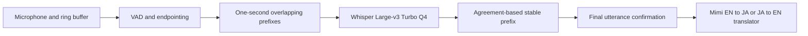

# Mimi local real-time STT review

Date: 2026-07-26

## Decision

Whisper Large-v3 Turbo Q4 is the exploratory lead on Mimi's fixed 24-clip
screens. It is the first candidate whose paired intervals exclude zero against
Apple in both speech-input languages on these selected slices:

* Japanese CER: 6.73% versus Apple 11.06%.
* English WER: 4.98% versus Apple 9.23%.
* Japanese protected-term recall: 73.2% versus Apple 61.0%.
* English protected-term recall: 90.9% versus Apple 78.8%.
* Model files: 463 MB.
* Duration-weighted offline compute RTF: 0.073 Japanese and 0.102 English.
* Peak process RSS: approximately 669 MB.

Do not make Parakeet, Nemotron, Qwen3-ASR Q4, or Reazon the default ahead of
this result. Package Whisper only behind a development gate until its
provenance and rolling partials pass the public paced benchmark.

The practical near-term architecture is one bilingual model with stabilized
rolling decoding:

The speech model itself satisfies the user's 500 MB cap. Together with Mimi's
roughly 147 MB translation pack, neural weights total about 610 MB, so a 500 MB
cap for all app models cannot be met without further compression or optional
asset packs.

Accuracy on the current screens is no longer the main blocker. The Python MLX
implementation's raw
AlignAtt streaming path emits unstable Japanese startup fragments and broken
byte-token surfaces at its default settings. Its high-quality whole-utterance
path is much faster than real time, but a Swift rolling-prefix implementation
must still prove stable first text, confirmation latency, and finalization
latency before promotion.

## Native Swift integration probe

The exact Q4 checkpoint now loads and transcribes through MLX Audio Swift 0.1.3
after a minimal experimental loader patch. The patch quantizes the model before
loading Q4 tensors, maps the tied token-embedding scales and biases, and uses
the quantized tied embedding for vocabulary projection. It is preserved at
`Research/speech/patches/mlx-audio-swift-0.1.3-whisper-q4.patch`.

On the first public FLEURS clip in each language, the native Swift final
transcript matched the Python checkpoint's content. Japanese matched exactly
apart from normalization punctuation. English preserved the same content and
the same minor `year` versus `years` reference error as Python. Model load was
approximately 1.03 seconds.

The naive rolling algorithm repeatedly decodes the entire observed prefix. It
is accurate but not real time:

| Native prototype | Japanese | English |
| --- | ---: | ---: |
| Audio duration | 10.44 s | 10.56 s |
| 1 s rolling cumulative RTF | 1.46 | 1.09 |
| First stable text | 5.05 s | 5.00 s |
| Final text timestamp | 11.75 s | 11.69 s |
| 2 s rolling cumulative RTF | 0.75 | Not measured |
| 2 s first stable text | 7.14 s | Not measured |

This proves checkpoint and native-runtime compatibility, not product
readiness. The dependency patch has not been released upstream, and a fresh
SwiftPM checkout does not contain it. Mimi therefore does not yet add the
dependency or bundle these weights. The next implementation should use bounded
audio windows, VAD endpointing, encoder-state reuse where possible, and prompt
carry-over rather than cumulative full-prefix re-decode. A reproducible
upstream revision or maintained public fork is required before integration.

The shipping source currently exposes only Apple's SpeechAnalyzer path. Qwen
and Nemotron sources are excluded by `Package.swift`, and the compiled path
uses `LegacyModelStubs.swift`. Keep Apple available as a temporary fallback
until the expanded paced gate passes, then make Whisper the intended default.

## Why Japanese to English currently fails

The leading cause is upstream Japanese ASR corruption, followed by long noisy
segments that encourage translation compression.

Observed live transcript substitutions include:

| Spoken term | Apple transcript |
| --- | --- |
| SARSA | `サルサー`, `サルサート` |
| Q-learning | `9ラーニング`, `Qlaning` |
| Q function | `休関数` |
| value function | `価値観数` |
| policy | `方作`, `工作` |
| gradient | `購買` |

In a controlled local replay, Mimi's translator preserved corrected technical
terms and symbols. The same translator could not reconstruct Q-learning, R_t,
SARSA, or A_{t+1} after the ASR transcript had already destroyed them. This
supports the following ordering:

1. ASR corruption is the primary failure.
2. Segment length and punctuation are secondary.
3. Translation quantization is not yet supported as the primary cause.

Private session text remains under ignored local work directories and is not
committed.

## Reproducible Japanese screen

The screen pins `google/fleurs` at revision
`70bb2e84b976b7e960aa89f1c648e09c59f894dd`, config `ja_jp`, split `test`.
It deterministically selects 24 human clips with technical, numeric, acronym,
and named-entity density. Audio and generated reports stay ignored.

Metrics:

* Normalized corpus CER, where lower is better.
* Exact protected-term recall.
* Alias-aware protected-term recall, which accepts equivalent surfaces such as
  `80 km`, `80キロメートル`, and `八十キロメートル`.
* A deterministic 10,000-sample paired clip bootstrap.
* Compute RTF, load time, and peak process RSS for local engines.
* Time to first text and paced wall time for Apple's live app path.

The local engines use whole-file offline decode in this screen. Apple's RTF
includes real-time audio pacing. These values must not be presented as the same
latency measurement. The local runners also place preprocessing boundaries
differently, so their RTF values are directional diagnostics, not a fair
cross-engine speed ranking.

Hardware: Apple M3 Pro, 36 GB RAM, macOS 26.5.1.

| Engine | Model files | CER | Exact term recall | Alias-aware recall | Mean compute RTF | Peak RSS | Screen result |
| --- | ---: | ---: | ---: | ---: | ---: | ---: | --- |
| Apple SpeechAnalyzer progressive | System asset | 11.06% | 48.8% | 61.0% | Not comparable | Not captured | Reference |
| Whisper Large-v3 Turbo MLX Q4 | 463 MB | **6.73%** | **73.2%** | **73.2%** | 0.078 | 669 MB | **Exploratory lead** |
| ReazonSpeech K2 v2 INT8 | 160 MB | 11.45% | 36.6% | 68.3% | 0.022 | 722 MB | Statistical tie |
| Qwen3-ASR 0.6B MLX Q4 | 708 MB | 14.00% | 51.2% | 61.0% | 0.032 | 967 MB | Reject |
| Reazon Zipformer Base 2025 F32 | 393 MB | 13.30% | 26.8% | 26.8% | 0.060 | 2.50 GB | Reject current artifact |
| Nemotron 3.5 MLX Q8, 1.12 s context | 756 MB | 18.17% | 12.2% | 43.9% | 0.069 | 905 MB | Reject |
| Nemotron 3.5 MLX Q8, 320 ms context | 756 MB | 19.03% | 14.6% exact | Not reported | 0.135 | 884 MB | Reject |

Conditional on this fixed selected slice, the paired 95% CER interval for
Whisper minus Apple is -7.34 to -1.85 percentage points. Whisper wins 15 clips,
Apple wins 4, and 5 tie. Boundary-aware protected-term recall improves by
12.20 points, although its small-sample interval of -2.70 to +26.83 still
crosses zero.

For Reazon K2 minus Apple, the paired 95% interval is:

* CER difference: -2.25 to +2.90 percentage points.
* Alias-aware term-recall difference: -9.09 to +17.78 percentage points.

The 24-clip screen does not establish a winner between Apple and Reazon. It does
establish that Nemotron Q8 is worse on this slice. For Nemotron minus Apple, the
CER interval is +5.14 to +9.57 points and the alias-aware term-recall interval
is -35.71 to -7.41 points.

## Reproducible English screen

The English screen pins the same FLEURS dataset revision, config `en_us`, split
`test`, with 24 deterministic clips containing numbers, named entities,
acronyms, and technical terms. It uses normalized corpus WER and the same paired
bootstrap.

| Engine | WER | Exact term recall | Alias-aware recall | Mean compute RTF | Peak RSS |
| --- | ---: | ---: | ---: | ---: | ---: |
| Apple SpeechAnalyzer progressive | 9.23% | 78.8% | 78.8% | Not comparable | Not captured |
| Whisper Large-v3 Turbo MLX Q4 | **4.98%** | **90.9%** | **90.9%** | 0.118 | 645 MB |

Conditional on this fixed selected slice, the paired 95% WER interval for
Whisper minus Apple is -6.65 to -2.04 percentage points. Whisper wins 14 clips,
Apple wins 3, and 7 tie. Its protected-term improvement is also positive, with
a paired interval of +2.70 to +25.93 points.

Apple's paced path took 283.2 seconds for this screen, with first-text p50
2.23 seconds and p95 2.29 seconds. Whisper's current number is offline compute
RTF, not paced first-text latency.

Limitations:

* Each language has only 24 read-speech clips.
* All 24 selected Japanese FLEURS records use the same gender code.
* Term-heavy manual selection is intentional and not population-representative.
* Exact term recall penalizes orthographically different but equivalent
  numbers. Alias-aware recall corrects only registered cases.
* FLEURS itself warns that read-speech accuracy can differ from noisy production
  speech.

## Candidate review

| Candidate | EN and JA | Native streaming | Distributable license status | Practical finding |
| --- | --- | --- | --- | --- |
| NVIDIA Parakeet TDT 0.6B v3 | No Japanese | No Mimi-ready bilingual path | CC-BY-4.0 | The standard model covers 25 mostly European languages. It is not an EN and JA model. |
| NVIDIA Parakeet TDT-CTC 0.6B JA | Japanese only | Not validated as incremental in Mimi | CC-BY-4.0 | Strong official Japanese CER, but requires a second English model and a new optimized Apple runtime. |
| NVIDIA Nemotron 3.5 ASR 0.6B | Yes | Yes, 80 to 1120 ms chunks | Source card says OpenMDW-1.1; MLX card says NVIDIA Open Model License | Best single-model streaming hypothesis, but the 756 MB Q8 MLX conversion failed the local Japanese screen. |
| Qwen3-ASR 0.6B | Yes | Yes upstream through vLLM | Apache-2.0 | Rejected as Mimi's default. The measured MLX Q4 artifact is about 708 MB and was worse than both Whisper and Apple on Japanese. |
| ReazonSpeech K2 v2 INT8 | Japanese only | No cached incremental path | Apache-2.0 model | Best compact Japanese fallback measured here. Its 160 MB footprint is attractive, but it tied Apple on the small screen and needs a second English model. |
| Reazon Zipformer Base 2025 | Japanese only | No, full-context CTC | Apache-2.0 model | Newer and only 98M parameters, but the current F32 artifact regressed CER, terms, and RSS locally. |
| Moonshine v2 Small Streaming | English only | Yes | MIT for English weights | Strong English specialist candidate with a native Swift library. |
| Moonshine v2 Base Japanese | Japanese only | Yes | Non-commercial model license | Cannot ship in Mimi. The MIT code and architecture remain useful for training an original student. |
| Whisper Large-v3 Turbo MLX Q4 | Yes | Rolling window, not native cached streaming | Upstream is MIT; exact hosted conversion provenance is pending | Current exploratory lead. The 463 MB artifact clears both language screens and the speech-only cap. Reproduce the conversion from a pinned upstream revision before redistribution. |
| SenseVoiceSmall | Yes | Low-latency offline path | FunASR model terms need review | Do not bundle until commercial redistribution terms are resolved. |

Primary sources:

* [Nemotron 3.5 model card](https://huggingface.co/nvidia/nemotron-3.5-asr-streaming-0.6b)
* [Nemotron MLX Q8 conversion](https://huggingface.co/mlx-community/nemotron-3.5-asr-streaming-0.6b-8bit)
* [OpenMDW 1.1](https://openmdw.ai/license/1-1/)
* [Japanese Parakeet model card](https://huggingface.co/nvidia/parakeet-tdt_ctc-0.6b-ja)
* [Qwen3-ASR model card](https://huggingface.co/Qwen/Qwen3-ASR-0.6B)
* [ReazonSpeech K2 v2 model card](https://huggingface.co/reazon-research/reazonspeech-k2-v2)
* [Reazon Zipformer 2025 model card](https://huggingface.co/reazon-research/japanese-zipformer-base-k2-rs35kh)
* [Whisper Large-v3 Turbo MLX Q4 conversion](https://huggingface.co/mlx-community/whisper-large-v3-turbo-asr-4bit)
* [Original Whisper Large-v3 Turbo model card](https://huggingface.co/openai/whisper-large-v3-turbo)
* [MLX Audio Swift](https://github.com/Blaizzy/mlx-audio-swift)
* [Moonshine v2 repository](https://github.com/moonshine-ai/moonshine)
* [Moonshine v2 paper](https://arxiv.org/abs/2602.12241)
* [Zipformer paper](https://arxiv.org/abs/2310.11230)

## Literature synthesis

The 2026 evidence reinforces a two-stage strategy:

1. Ship the strongest measured checkpoint through a stabilized rolling decoder.
   Whisper Large-v3 Turbo keeps the multilingual encoder but prunes the decoder
   from 32 layers to 4. Its 4-bit MLX conversion is already the first bilingual
   checkpoint to clear Mimi's accuracy screen.
2. Distill a smaller streaming student after the product harness is mature.
   Moonshine v2 shows why bounded local attention is attractive for low
   time-to-first-token. Distil-Whisper shows that large-scale pseudo-label
   filtering can preserve much of a large Whisper teacher's quality. Recent
   compact streaming work also finds that quantization and runtime graph
   optimization must be evaluated together, not as model-size changes alone.

Qwen3-ASR's published streaming result is important evidence that a 0.6B
multilingual model can emit low-latency partials, but its published streaming
backend is vLLM, not an on-device MLX Swift path. Mimi's direct Japanese screen
also rejected the current Q4 conversion on both accuracy and size.

An MoE is not justified for the first bundled STT release. One bilingual model
avoids language-router errors and duplicate acoustic encoders. A future sparse
student could share one encoder and activate small language or terminology
adapters, but it should be promoted only if the packaged experts, memory
traffic, and Metal latency beat a dense student. Parameter count alone is not a
useful on-device MoE win when all experts still have to ship and load.

Relevant papers:

* [Moonshine v2](https://arxiv.org/abs/2602.12241)
* [Qwen3-ASR technical report](https://arxiv.org/abs/2601.21337)
* [Compact on-device streaming ASR study](https://arxiv.org/abs/2604.14493)
* [On-device cascaded streaming speech translation](https://arxiv.org/abs/2508.13358)
* [Distil-Whisper](https://arxiv.org/abs/2311.00430)

## Compression and distillation strategy

Use the measured Whisper Q4 checkpoint as the near-term product candidate and
teacher. In parallel, train a 100M to 160M Japanese streaming Zipformer RNN-T or
Moonshine v2 student, then compare it with a single bilingual student and an
English Moonshine specialist. Start from a compact pretrained encoder or open
checkpoint. Do not train the full acoustic representation from scratch unless
adaptation fails.

Teacher ensemble:

1. Whisper Large-v3 Turbo as the measured bilingual lead teacher.
2. Japanese Parakeet 0.6B as a strong Japanese specialist teacher.
3. Qwen3-ASR 1.7B as an independent multilingual teacher.
4. Reazon Nemo v2 as an independent Japanese architecture.

Training targets should be transcripts, token posteriors, timestamps, alignment,
and confidence. Reasoning traces are not useful ASR supervision. They add text
that the student should never emit. An LLM can classify errors for analysis, but
those explanations must not become decoder targets.

Safe pseudo-label filtering:

1. Start only with audio whose license explicitly permits the intended
   commercial training and redistribution workflow.
2. Keep human transcripts when available.
3. Normalize punctuation and numeric surfaces before teacher agreement checks.
4. Require teacher-to-reference agreement or multi-teacher consensus.
5. Reject low confidence, high entropy, wrong-language, repeated, truncated,
   or acoustically corrupt samples.
6. Preserve a separate technical subset for terms, acronyms, symbols, and
   numbers.
7. Deduplicate by audio hash, acoustic fingerprint, transcript fingerprint,
   speaker, and source document.
8. Exclude every registered benchmark speaker, clip, transcript, and
   near-duplicate before training.
9. Record dataset revision, source license, teacher revision, filter version,
   and row lineage in a public data card.
10. Review random accepted and rejected slices with independent automated
    critics. Human review is optional for the experiment, not required by the
    pipeline.

Useful objectives:

* RNN-T or CTC sequence loss on human and accepted pseudo-labels.
* Frame or token posterior KL from the teacher where architectures align.
* Chunked-attention training with variable right context.
* Contextual-bias or hotword loss for registered terminology.
* Noise, room, microphone, tempo, and endpoint augmentation.
* Plain-data replay to prevent technical fine-tuning from reducing general
  speech quality.

[Distil-Whisper](https://arxiv.org/abs/2311.00430) provides useful evidence for
large-scale pseudo-label filtering and teacher-student ASR. Moonshine v2
provides the more relevant bounded-latency student architecture.

## Data and licensing plan

Do not simply download every high-quality Japanese corpus.

| Data | Status for Mimi |
| --- | --- |
| Common Voice Japanese and English | Preferred starting source. Current scripted releases are CC0-1.0. |
| FLEURS | CC-BY-4.0. Keep validation and test out of training. Use train only with attribution if needed. |
| ReazonSpeech v2 corpus | Block for Mimi training pending legal review. The dataset is gated, CDLA-Sharing-1.0, and restricts use to Japanese Copyright Act Article 30-4. Apache licensing of published model weights does not erase the dataset terms. |
| JVS | Do not use by default. Audio is limited to academic, non-commercial research, or personal use unless separate commercial permission is obtained. |
| JTubeSpeech | Do not use. Its stated use is research and development only. |
| CPJD and JVNV | CC-BY-SA-4.0. Hold until share-alike obligations for distributed model weights are reviewed. |
| Synthetic technical speech | Use only when the TTS model, voice, source text, and generated-data terms all permit commercial training and public release. |

Sources:

* [Common Voice datasets](https://commonvoice.mozilla.org/en/datasets)
* [FLEURS dataset card](https://huggingface.co/datasets/google/fleurs)
* [ReazonSpeech dataset card](https://huggingface.co/datasets/reazon-research/reazonspeech)
* [JVS terms](https://sites.google.com/site/shinnosuketakamichi/research-topics/jvs_corpus)
* [JTubeSpeech terms](https://sites.google.com/site/shinnosuketakamichi/research-topics/jtubespeech-asv_corpus)

## Promotion benchmark

The 24-clip sets are manually selected, term-heavy screens. Their bootstrap
intervals condition on the selected records and do not correct for candidate or
configuration screening. Before replacing Apple or shipping a bundled
candidate, register at least:

* 200 held-out Japanese human utterances.
* 200 held-out English human utterances.
* 50 technical and code-switch utterances.
* 20 long-form sessions covering meetings, lectures, and documents.
* Both speaker genders, multiple accents, microphones, noise levels, and speech
  rates.
* 30-minute and 120-minute live thermal, memory, and dropped-audio soaks.

Every candidate must use the same paced audio harness. Report:

* Japanese CER and English WER with paired confidence intervals.
* Exact and alias-aware protected-term recall.
* Numeric-value and named-entity recall.
* Time to first stable text, confirmation latency, and finalization latency.
* Hypothesis churn, dropped audio, backpressure, and long-form drift.
* Steady-state compute RTF, peak RSS, energy, model files, and signed app size.

Initial promotion gates:

* The paired 95% confidence interval shows no accuracy regression against Apple
  in either language.
* Technical and numeric recall improve, with no new catastrophic deletions or
  repetitions.
* First stable text p50 is at most 250 ms and p95 at most 500 ms.
* Final text arrives within 1 second p95 after detected speech end.
* Compute RTF is below 0.25 on the M3 Pro reference machine.
* Peak speech-engine RSS is below 1 GB.
* Total distributable model weights remain below 500 MB, with 350 MB as the
  preferred speech-only target.
* Every model and dataset revision, hash, license, attribution, and notice is
  included and reproducible.

Whisper Q4 passes the current 24-clip accuracy and speech-model-size screens in
both languages. It has not yet passed the paced partial-stability, long-form,
thermal, energy, or total-bundle gates.

Only after this public gate passes should Mimi expose the engine in
`selectableCases`. The existing Apple path remains available during the
experiment even if it is not the intended final product engine.

## Reproduction

Tracked scripts:

* `scripts/speech/prepare_fleurs_ja_screen_v1.py`
* `scripts/speech/prepare_fleurs_en_screen_v1.py`
* `scripts/speech/run_apple_speech_benchmark.py`
* `scripts/speech/run_reazon_k2_benchmark.py`
* `scripts/speech/run_reazon_zipformer_benchmark.py`
* `scripts/speech/run_nemotron_mlx_benchmark.py`
* `scripts/speech/run_qwen3_asr_mlx_benchmark.py`
* `scripts/speech/run_whisper_mlx_benchmark.py`
* `scripts/speech/compare_asr_benchmarks.py`
* `scripts/speech/README.md`

The public FLEURS manifests, Apple reports, Whisper reports, and pairwise
comparisons used in this review are committed with the report. Generated audio,
downloaded weights, and private probes remain under ignored work directories.
Exact commands and dependency pins are in `scripts/speech/README.md`.
