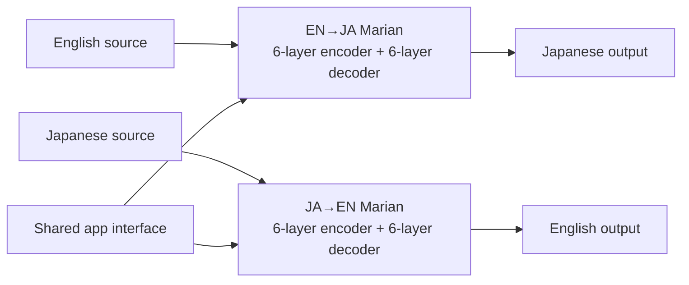

# Mimi EN↔JA development accuracy v1

Date: 2026-07-25

Status: reproducible development evidence only. This report does not authorize
promotion, app integration, or a public model release.

## Outcome

Mimi now has a deterministic 200-case English↔Japanese development benchmark:
100 cases per direction, including 20 six-segment documents per direction. The
suite compares the shipped 4-bit ElanMT pair, Apple Translation, and a
license-traceable fine-tuned candidate with chrF++, sacreBLEU, pinned COMET-22,
blinded source-based LLM judgments, structural checks, latency, memory, and
bundle size.

The shipped Mimi model is much faster than Apple and looks stronger under
chrF++ for EN→JA, but COMET-22 and two blinded GPT-5.6 judge variants prefer
Apple overall. chrF++ alone was therefore giving an incomplete answer.

The new fine-tuned pair is a meaningful development improvement over the
shipped pair. It raises COMET-22 in both directions, makes a large JA→EN legal
gain, removes the shipped model's two empty legal-document segments, remains
below 150 MB, and stays under the 250 ms segment-latency target. It is not being
put into the app because this public suite is not promotion evidence and the
candidate still has domain regressions and critical errors.

## Model shape

The app exposes one bidirectional translation interface, backed by two compact
direction specialists:



Each specialist has a 512-wide hidden representation, eight attention heads,
2,048-wide feed-forward layers, a 32,001-token vocabulary, and 4-bit affine MLX
weights with group size 64. The minimal two-direction package is 73,425,808
bytes. It is operationally one translator but not one shared neural checkpoint;
earlier single-checkpoint experiments did not match the two specialists.

Candidate composition:

- EN→JA: arithmetic mean of steps 500, 750, and 1,000 from the
  release-clean full-depth human-reference continuation.
- JA→EN: step 750 of the release-clean legal-specialist human-reference
  continuation.
- Training targets: licensed human or project-owned references only.
- Synthetic targets and reasoning traces: none.

## Benchmark contract

| Property | Value |
|---|---:|
| Case units | 200 |
| Segment inference calls | 400 |
| Sentences | 160 |
| Six-segment documents | 40 |
| Cases per direction | 100 |
| Sentence domains per direction | 20 each: conversation, news, Wikipedia, legal |
| Document domains per direction | 8 news, 6 Wikipedia, 6 legal |
| Suite SHA-256 | `0684350a4c941a7fc87801444c027e0f5c02ba6f77418c792428d4200b521605` |
| Segment-suite SHA-256 | `b464dfbfe128b3e0cbac2652d8db6ddb976536638676a1dca6e07507eb32a58f` |

Selection is deterministic from declared test splits using SHA-256 ordering and
a fixed seed. The documents preserve coherent ALT/JLT groups or contiguous KFTT
blocks and are translated segment-by-segment, then joined with newlines, which
matches Mimi's transcript-document behavior.

Three of 40 joined documents exceed the current 192-token direct-input table;
no individual segment does. The benchmark therefore exercises realistic long
documents without silently truncating them, but it does not measure
cross-segment context or independent document-level bilingual review.

This is intentionally non-claimable:

- every segment has one human reference;
- public corpora may overlap opaque upstream pretraining;
- composed documents have no fresh document-level review;
- these public test rows may have influenced prior research;
- the sealed 400+400 promotion suite was not read, modified, or evaluated.

## Metrics

### Shipped Mimi versus Apple

| Direction | Engine | chrF++ | BLEU | COMET-22 |
|---|---|---:|---:|---:|
| EN→JA | Shipped Mimi | 28.13 | 9.14 | 0.8486 |
| EN→JA | Apple | 25.28 | 6.40 | 0.8728 |
| JA→EN | Shipped Mimi | 50.06 | 25.77 | 0.7825 |
| JA→EN | Apple | 54.29 | 29.97 | 0.8208 |

The reference metrics and learned metric disagree in EN→JA. COMET-22 favors
Apple over the shipped model by -0.0242 for Mimi (95% paired interval
-0.0493 to -0.0014) and by -0.0383 in JA→EN (-0.0642 to -0.0135).

Two source-only blinded judge variants reached the same qualitative conclusion:

| Judge | Mimi overall wins | Apple overall wins | Ties | Mimi critical errors | Apple critical errors |
|---|---:|---:|---:|---:|---:|
| GPT-5.6-sol | 63 | 102 | 35 | 60 | 37 |
| GPT-5.6-terra | 63 | 95 | 42 | 22 | 3 |

The absolute critical-error counts differ substantially by judge strictness.
Their preference direction agrees, so the counts are a sensitivity range, not a
single ground truth.

### MoE and shared-delta follow-up

The first full-expert task routers are rejected. An older four-engine router
fits below 150 MB and remains fast, but does not improve the candidate. A
public-stress-calibrated JA→EN legal/critical router also failed to transfer to
this document-heavy suite.

A reference-aware upper-bound analyzer confirms that existing experts still
contain complementary outputs. A document-sticky oracle gains +0.743 mean
sentence chrF++ EN→JA (grouped 95% interval +0.425 to +1.130) and +1.578 JA→EN
(+0.821 to +2.606). This oracle reads held-out references and is not a
deployable router.

The first shared-backbone feasibility arm compresses a JA→EN expert into
low-rank deltas around the legal parent. Rank 16 needs 5.67 MB and captures
76.4% of squared weight-delta energy; rank 32 needs 11.03 MB and captures
82.5%. A frozen high-precision conversation router changes 16/200 independent
JA→EN development segments and gains +0.442 mean sentence chrF++, but its
grouped 95% interval (-0.007 to +1.189) crosses zero. Rank 32 produces the same
routed hypotheses. The representation is compact; the candidate is rejected.

### Claude Fable 5 consultation and direct-adapter check

An isolated Claude CLI consultation was run with
`claude -p --model claude-fable-5`. It received aggregate architecture,
runtime, size, and metric evidence only; it received no API key, private suite,
benchmark references, or hidden reasoning traces. Its useful recommendation was
to stop token-level MoE and learned routing, directly train low-rank updates as
a bounded control, then move to a purpose-distilled deep-encoder/shallow-decoder
student if the control failed.

Two consultation statements were corrected before execution:

- The +0.743 EN→JA and +1.578 JA→EN sticky-oracle gains are sentence chrF++,
  not COMET.
- 73,425,808 bytes is the complete bidirectional minimal pack, not one
  direction. The current architecture therefore has more size headroom than
  the consultant assumed.

The implemented rank-16 control uses alpha 32 and dropout 0.05. It adapts 36
Marian Linear modules: decoder cross-attention q/v/output plus both decoder FFN
matrices in every layer, and encoder self-attention q/v in the top three
layers. It trains 884,736 parameters and produces a 3,547,024-byte floating
adapter before merging. Zero initialization reproduces the parent logits and
greedy translation exactly. A nonzero real-checkpoint adapter differs from its
merged equivalent by at most 1.72e-5 in logits, attributable to floating-point
operation order.

The training inputs are license-authenticated and independently screened
against all 400 development segments on both source and target/reference sides.
The 5-character-ngram filter uses NFKC, case-folding, whitespace removal, and
an exclusive Jaccard threshold of 0.8:

| Direction | Train rows | Validation rows | Exact/near exclusions |
|---|---:|---:|---:|
| EN→JA balanced human-reference | 5,546 | 1,085 | 0 |
| JA→EN balanced human-reference | 7,235 | 1,285 | 0 |
| EN→JA plus ALT document windows | 7,546 | 1,085 | 0 |
| JA→EN plus ALT document windows | 9,235 | 1,285 | 0 |

The expanded datasets add 2,000 deterministic, coherent 2–4-sentence ALT train
windows per direction. Windows use a non-overlapping stride within each window
size; different window sizes may reuse a component sentence. They do not
concatenate unrelated sentences and do not use development/test documents.

Two bounded EN→JA cells failed the validation stop gate:

| Cell | Step 0 chrF++ | Step 50 | Step 100 | Selected |
|---|---:|---:|---:|---|
| Rank-16, sentence-level licensed mixture, LR 1e-4 | 31.110 | 30.292 | 29.975 | Step 0 |
| Rank-16, coherent ALT windows, LR 5e-5, frozen-parent KL 0.05 | 31.110 | 30.910 | 30.909 | Step 0 |

Both candidate selections would therefore be the unchanged parent. The second
cell's final serialization encountered a full-disk error after evaluation; the
rejected/incomplete generated artifacts and an earlier rejected checkpoint
directory were removed, recovering about 1.17 GB. No evaluated trained
checkpoint qualified for quantization, development-suite selection, JA→EN
replication, packaging, or app integration.

### Fine-tuned candidate

| Direction | Engine | chrF++ | BLEU | COMET-22 |
|---|---|---:|---:|---:|
| EN→JA | Shipped Mimi | 28.13 | 9.14 | 0.8486 |
| EN→JA | Candidate | 28.41 | 9.63 | 0.8669 |
| EN→JA | Apple | 25.28 | 6.40 | 0.8728 |
| JA→EN | Shipped Mimi | 50.06 | 25.77 | 0.7825 |
| JA→EN | Candidate | 55.19 | 30.62 | 0.8192 |
| JA→EN | Apple | 54.29 | 29.97 | 0.8208 |

Paired candidate-versus-shipped deltas:

- EN→JA COMET-22: +0.0183, 95% interval -0.00003 to +0.0398.
- JA→EN COMET-22: +0.0367, 95% interval +0.0189 to +0.0576.
- EN→JA mean sentence chrF++: +0.75, interval -0.50 to +2.09.
- JA→EN mean sentence chrF++: +4.05, interval +1.49 to +6.65.

Candidate COMET-22 is statistically indistinguishable from Apple overall on
this suite:

- EN→JA: -0.0060, 95% interval -0.0217 to +0.0100.
- JA→EN: -0.0016, 95% interval -0.0169 to +0.0150.

The largest reliable gain is JA→EN legal translation. Against the shipped
model, COMET-22 rises by +0.1416 on 20 legal sentences and +0.0946 on six long
legal documents, both with positive paired intervals. The candidate still
loses to Apple on the 20-sentence legal COMET slice in each direction, and its
EN→JA long-legal aggregate does not improve.

The conservative exact-token structure audit flags 62/200 candidate cases,
versus 66/200 for shipped Mimi and 50/200 for Apple. These regex-based counts
overflag bilingual number formatting and are diagnostic only.

The candidate-vs-shipped blinded judges disagree on statistical preference:

| Judge | Candidate overall wins | Shipped overall wins | Ties | Candidate critical errors | Shipped critical errors |
|---|---:|---:|---:|---:|---:|
| GPT-5.6-sol | 70 | 44 | 86 | 47 | 63 |
| GPT-5.6-terra | 91 | 85 | 24 | 14 | 13 |

The sol variant prefers the candidate (two-sided exact sign-test
`p=0.0188`) and finds fewer critical errors. Terra finds no significant
preference (`p=0.7064`) and one more candidate critical error. This sensitivity
is another reason not to treat automated judgment as a promotion decision.

## Runtime

Measured on Apple M3 Pro with MLX 0.30.6, cached greedy decoding, a
block-preallocated decoder K/V cache, and one precomputed 192×512 position
table:

| Property | EN→JA | JA→EN |
|---|---:|---:|
| Warm segment p50 | 61.7 ms | 69.4 ms |
| Warm segment p95 | 165.4 ms | 159.5 ms |

| Shared property | Value |
|---|---:|
| Full research directories | 78,280,207 bytes |
| Minimal package | 73,425,808 bytes |
| Peak resident memory | 210,812,928 bytes |
| Model preparation | 138 ms |

The optimized runtime stays under the preregistered 250 ms warm segment p95.
Document latency is the sum of its segment calls and scales approximately
linearly with document length.

## Translation examples

### Legal list item, EN→JA

Source:

> (iii) 1-Amino-9,10-anthraquinone

| Output | Translation |
|---|---|
| Human reference | 三 一―アミノ―九・一〇―アントラキノン |
| Candidate | (3)1-アミノ-9,10-アントラキノン |
| Shipped Mimi | ) |
| Apple | (iii) 1-アミノ-9,10-アントラキノン |

The candidate fixes a catastrophic shipped output, although its enumeration
format differs from the reference.

### Legal heading, JA→EN

Source:

> （外国監査法人等に対する報告徴収及び立入検査）

| Output | Translation |
|---|---|
| Human reference | (Collection of Reports from and On-Site Inspections of Foreign Audit Firms) |
| Candidate | (Collection of Reports and Inspection for Foreign Auditors) |
| Shipped Mimi | . |
| Apple | (Collection of reports and inspection of foreign auditing firms, etc.) |

### Conversation, JA→EN

Source:

> 窓辺に向かった。

| Output | Translation |
|---|---|
| Human reference | I went to the window. |
| Candidate | I headed for the window. |
| Shipped Mimi | I made for the window. |
| Apple | I went to the window. |

All three are usable; a single reference cannot express all valid wording.

### Long-document failure

The candidate materially regresses one six-segment EN→JA casino-law document:
it falls into severe repetition in the fifth segment. This is a concrete reason
not to replace the shipped model globally from aggregate metrics alone.

## Data and licensing

The benchmark contains 40 Tatoeba/ManyThings cases under CC BY 2.0 France, 56
ALT cases under CC BY 4.0, 52 KFTT cases under CC BY-SA 3.0, and 52 Japanese Law
Translation cases under PDL 1.0-compatible terms. Every row retains its corpus,
source ID, license, attribution, split, and review status.

The candidate's training manifests authenticate human-reference mixtures from
the same license families plus project-owned Mimi UI pairs. The quantized
weights are publicly released as CC BY-SA 4.0 adaptations of pinned ElanMT
revisions. Corpus notices, a change statement, and all 9,162 retained Tatoeba
contributor records accompany the model. The public benchmark preserves every
row's original open license; Mimi's selection metadata and arrangement are
released under CC BY-SA 4.0.

No supplied API secret was written to disk, commands, artifacts, or Hugging
Face. The LLM judges were run as isolated Codex agents and emitted only compact
verdicts, never hidden reasoning traces.

## Decision

Do not replace the app's shipped models yet. The candidate is genuinely
promising, especially for JA→EN legal text, but the development suite is public,
the EN→JA improvement is inconclusive, long-document failures remain, automated
judges still find critical errors, and release attribution review is incomplete.

The next promotion attempt should:

1. Use the candidate as a teacher/student starting point, not train from
   scratch.
2. Distill final translations and calibrated quality signals only; do not train
   on private chain-of-thought.
3. Add document-aware curriculum rows with segment context, terminology
   consistency, enumeration, and repetition penalties.
4. Use uncertainty/diversity selection plus frozen-base KL and checkpoint
   averaging.
5. Require cross-corpus expert complementarity before training another router.
   The first two full-model task routers failed independent development
   transfer, a 200-step legal-parent conversation continuation selected the
   unmodified parent as its best checkpoint, and post-hoc rank-16/rank-32
   deltas remained statistically inconclusive under frozen routing.
6. Stop the direct-adapter line: two independently configured EN→JA cells
   selected the unchanged parent. The next architecture experiment should train
   a deep-encoder/shallow-decoder student from its initialization under sequence
   distillation, rather than delete decoder layers or attach another router.
7. Evaluate once on the untouched sealed 400+400 suite with COMET, reference
   metrics, two independent blinded judge families, and a zero-new-critical
   union veto.

## Reproduction

```sh
python3 scripts/translation/prepare_development_accuracy_suite.py \
  Research/translation/benchmark/public-stress-v3.jsonl \
  Research/translation/benchmark/development-accuracy-v1.jsonl \
  Research/translation/benchmark/development-accuracy-v1.segments.jsonl

uv run --python 3.12 --with mlx==0.30.6 \
  --with transformers==4.57.6 --with sentencepiece --with sacremoses \
  scripts/translation/run_mlx_marian_benchmark.py \
  Research/translation/benchmark/development-accuracy-v1.segments.jsonl \
  OUTPUT.json --en-ja-model EN_JA_MODEL --ja-en-model JA_EN_MODEL \
  --warm-runs 1 --cached-decoding \
  --preallocated-kv-cache-block-size 192 --precomputed-position-table

python3 scripts/translation/compose_segmented_document_benchmark.py \
  Research/translation/benchmark/development-accuracy-v1.jsonl \
  OUTPUT.json COMPOSED.json

uv run --python 3.12 --with sacrebleu==2.6.0 \
  scripts/translation/score_translation.py COMPOSED.json

uv run --python 3.12 \
  --with-requirements Research/translation/comet-runtime-v1-requirements.txt \
  scripts/translation/score_comet.py \
  Research/translation/benchmark/development-accuracy-v1.jsonl \
  COMPOSED.json COMET.json

uv run --python 3.12 --with sacrebleu==2.6.0 \
  scripts/translation/analyze_expert_oracle.py \
  Research/translation/results/development-accuracy-v1-candidate-clean-pair-segments.json \
  ORACLE.json --direction ja-en --sticky-documents \
  --expert critical=CRITICAL_REPORT.json \
  --expert conversation=CONVERSATION_REPORT.json \
  --expert preferred-v2=PREFERRED_V2_REPORT.json

PYTHONPATH=scripts/translation uv run --python 3.12 \
  --with numpy --with scikit-learn --with sacrebleu==2.6.0 \
  scripts/translation/evaluate_saved_expert_router.py \
  Research/translation/benchmark/development-accuracy-v1.segments.jsonl \
  BASELINE_REPORT.json EXPERT_REPORT.json FROZEN_ROUTER.json \
  ROUTED_EVALUATION.json --direction ja-en

python3 scripts/translation/build_alt_document_window_dataset.py \
  Research/translation/work/balanced-human-reference-en-ja-v1 \
  Research/translation/work/alt/train.jsonl \
  Research/translation/work/balanced-human-reference-alt-windows-en-ja-v1 \
  --direction en-ja --window-size 2 --window-size 3 --window-size 4 \
  --maximum-windows 2000

python3 scripts/translation/filter_training_dataset_against_protected.py \
  Research/translation/work/balanced-human-reference-alt-windows-en-ja-v1 \
  Research/translation/work/balanced-human-reference-alt-windows-en-ja-v1-development-screened \
  --protected-suite \
  Research/translation/benchmark/development-accuracy-v1.segments.jsonl \
  --character-ngram-size 5 --maximum-jaccard 0.8

PYTHONPATH=scripts/translation uv run --python 3.12 \
  --with torch --with transformers==4.57.6 --with sentencepiece \
  --with sacremoses --with sacrebleu==2.6.0 --with numpy \
  --with safetensors --with huggingface-hub \
  scripts/translation/train_marian_low_rank_adapter.py \
  DATASET INITIAL_CHECKPOINT OUTPUT --direction en-ja \
  --repository Mitsua/elan-mt-bt-en-ja \
  --revision 02c48e7031386cd2d41974b0ff1aaf52f010c5fa \
  --rank 16 --alpha 32 --preset consultation-v1
```
